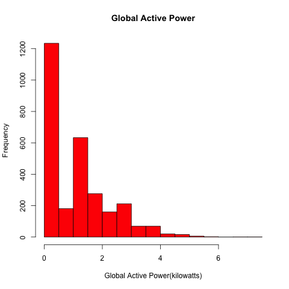
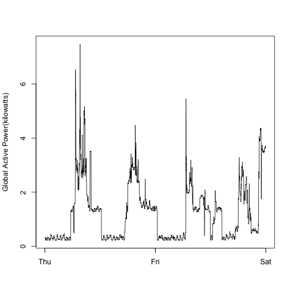
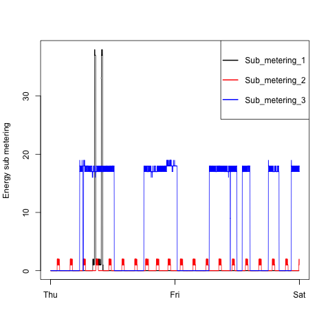
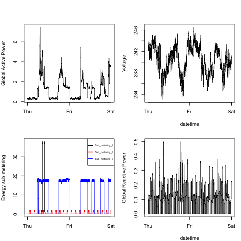

# Introduction

This assignment uses data from
the <a href="http://archive.ics.uci.edu/ml/">UC Irvine Machine
Learning Repository</a>, a popular repository for machine learning
datasets. In particular, we will be using the "Individual household
electric power consumption Data Set" which I have made available on
the course web site:

* <b>Dataset</b>: <a href="https://d396qusza40orc.cloudfront.net/exdata%2Fdata%2Fhousehold_power_consumption.zip">Electric power consumption</a> [20Mb]

* <b>Description</b>: Measurements of electric power consumption in
one household with a one-minute sampling rate over a period of almost
4 years. Different electrical quantities and some sub-metering values
are available.

The following descriptions of the 9 variables in the dataset are taken
from
the <a href="https://archive.ics.uci.edu/ml/datasets/Individual+household+electric+power+consumption">UCI
web site</a>:

<ol>
<li><b>Date</b>: Date in format dd/mm/yyyy </li>
<li><b>Time</b>: time in format hh:mm:ss </li>
<li><b>Global_active_power</b>: household global minute-averaged active power (in kilowatt) </li>
<li><b>Global_reactive_power</b>: household global minute-averaged reactive power (in kilowatt) </li>
<li><b>Voltage</b>: minute-averaged voltage (in volt) </li>
<li><b>Global_intensity</b>: household global minute-averaged current intensity (in ampere) </li>
<li><b>Sub_metering_1</b>: energy sub-metering No. 1 (in watt-hour of active energy). It corresponds to the kitchen, containing mainly a dishwasher, an oven and a microwave (hot plates are not electric but gas powered). </li>
<li><b>Sub_metering_2</b>: energy sub-metering No. 2 (in watt-hour of active energy). It corresponds to the laundry room, containing a washing-machine, a tumble-drier, a refrigerator and a light. </li>
<li><b>Sub_metering_3</b>: energy sub-metering No. 3 (in watt-hour of active energy). It corresponds to an electric water-heater and an air-conditioner.</li>
</ol>

#How the code works 

## Loading the data

'''
#Download data and and unzip.

if (!file.exists("exdata%2Fdata%2Fhousehold_power_consumption.zip")){
        fileURL <- "https://d396qusza40orc.cloudfront.net/getdata%2Fprojectfiles%2FUCI%20HAR%20Dataset.zip"
        download.file(fileURL,"exdata%2Fdata%2Fhousehold_power_consumption",method="curl")
        unzip("exdata%2Fdata%2Fhousehold_power_consumption.zip")
} 
'''
'''
## Loading data from txt

consumption <- read.table("household_power_consumption.txt",header=TRUE,sep=";",na.strings ="?" )
consumption$Date <-as.Date(consumption$Date, " %d / %m / %Y")
consumption <-subset(consumption,Date=="2007-02-01"|Date=="2007-02-02")
'''

## creating Plot1
'''
hist(as.numeric(consumption$Global_active_power),col="red",main="Global Active Power",xlab="Global Active Power(kilowatts)")
dev.copy(png, file = "plot1.png",width=480, height=480)
dev.off()
'''

## creating Plot 2

'''
timing <-as.POSIXct(paste(consumption$Date, consumption$Time), format="%Y-%m-%d %H:%M:%S")
plot(timing,consumption$Global_active_power,type="l",ylab="Global Active Power(kilowatts)",xlab="")
dev.copy(png, file = "plot2.png",width=480, height=480)
dev.off()
'''

## creating Plot 3

'''
plot(timing,consumption$Sub_metering_1,type="l",xlab="",col="black",ylab="Energy sub metering")
lines(timing,consumption$Sub_metering_2,type="l",col="red")
lines(timing,consumption$Sub_metering_3,type="l",col="blue")
legend("topright",pch=NA,col = c("black","red", "blue"), legend = c("Sub_metering_1", "Sub_metering_2","Sub_metering_3"),lwd=2)
dev.copy(png, file = "plot3.png",width=480, height=480)
dev.off()
'''

## creating Plot 4

'''
par(mfrow = c(2, 2), mar = c(4, 4, 2, 1), oma = c(0, 0, 2, 0))
timing <-as.POSIXct(paste(consumption$Date, consumption$Time), format="%Y-%m-%d %H:%M:%S")
plot(timing,consumption$Global_active_power,type="l",xlab="",ylab="Global Active Power")
plot(timing,consumption$Voltage,type="l",xlab="datetime",ylab="Voltage")
plot(timing,consumption$Sub_metering_1,type="l",xlab="",col="black",ylab="Energy sub metering")
lines(timing,consumption$Sub_metering_2,type="l",col="red")
lines(timing,consumption$Sub_metering_3,type="l",col="blue")
legend("topright",pch=NA,col = c("black","red", "blue"), legend = c("Sub_metering_1", "Sub_metering_2","Sub_metering_3"),lwd=2,cex=0.5)
plot(timing,consumption$Global_reactive_power,type="l",xlab="datetime",ylab="Global Reactive Power")
dev.copy(png, file = "plot4.png",width=480, height=480)
dev.off()
'''

### Plot 1

 

### Plot 2

 

### Plot 3

 

### Plot 4

 

